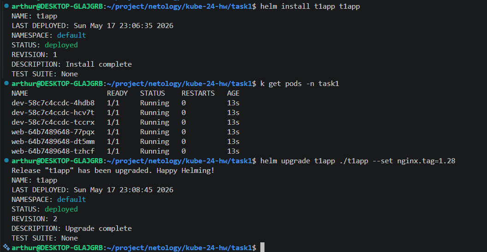
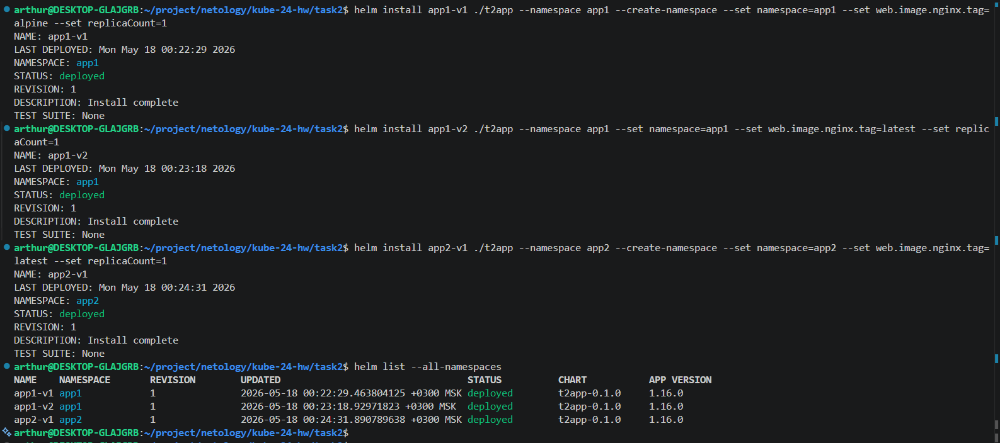

# Домашнее задание к занятию «Helm»

## Задание

### Цель задания

В тестовой среде Kubernetes необходимо установить и обновить приложения с помощью Helm.

------

### Задание 1. Подготовить Helm-чарт для приложения

1. Необходимо упаковать приложение в чарт для деплоя в разные окружения. 
2. Каждый компонент приложения деплоится отдельным deployment’ом или statefulset’ом.
3. В переменных чарта измените образ приложения для изменения версии.

------
### Задание 2. Запустить две версии в разных неймспейсах

1. Подготовив чарт, необходимо его проверить. Запуститe несколько копий приложения.
2. Одну версию в namespace=app1, вторую версию в том же неймспейсе, третью версию в namespace=app2.
3. Продемонстрируйте результат.

## Решение

### Задание 1

#### Установка Helm
```bash
curl -fsSL -o get_helm.sh https://raw.githubusercontent.com/helm/helm/main/scripts/get-helm-4
chmod 700 get_helm.sh
./get_helm.sh
```
#### Создаём helm chart для приложения
```bash
helm create myapp
```
#### Запускаем приложение
```bash
helm install myapp myapp
```

У меня всё это время был не настроен файл `~/.kube/config` и как-то было всё в microk8s нормально. Но вот helm очень уж хочет его видеть.

#### Создаём конфигурацию
```bash
microk8s config
# или
microk8s config > ~/.kube/config
```
#### Перечень всех helm чартов
```bash
helm list
# или
helm list -A
```
#### Удаляем helm чарт
```bash
helm delete myapp
```
#### Удаляем релиз
```bash
helm uninstall myapp
# или 
helm uninstall myapp --namespace default
# и чистим namespace
kubectl delete namespace default
```



### Задание 2

#### Проверка chart на валидность
```bash
helm lint myapp
```
По условию нам необходимо запустить chart в определенном namespace. Так как namespace у нас вынесен в values.yaml, то мы можем запустить chart с заданными переменными.
#### Запуск chart с заданными переменными
```bash
helm install myapp myapp --set image.tag=1.0.0
```
А фактически запуск выглядит следующим образом:
```bash
helm install app1-v1 ./t2app \
--namespace app1 \
--create-namespace \
--set namespace=app1 \
--set web.image.nginx.tag=alpine \
--set replicaCount=1
```
Пришлосы вынести создание namespace в параметры запуска helm.

#### Проверка запущенных чартов
```bash
helm list --all-namespaces
```
